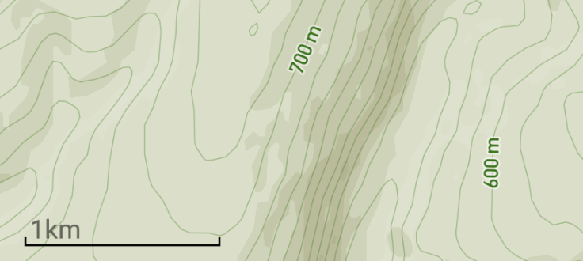

# react-native-scale-bar  [](https://badge.fury.io/js/react-native-scale-bar.svg) [](/)


Scale bar for MapView in React Native. Works with Mapbox and Google Map.




## Installation

```
npm install --save react-native-scale-bar
```

## Usage

```
<ScaleBar zoom={this.props.zoom_level} latitude={this.state.gpsCoord[1]} tile_size={512} />
```

## Properties

| Prop  | Required  | Type | Default |  Description |
| :------------ |:---------------:| :---------------:| :-----|
| zoom | yes | `number` | - | Pass the zoom level to the component to adjust the scale bar.  |
| latitude | no | `number` | 48.8187 | Use the latitude to adjust the scale bar precision.  |
| tile_size | no | `number` | 512 | Size of the map tile. Can be either 512 (Mapbox), or 256 (Google Map)  |
| left | no | `number` | 15 | Padding with left border of the screen.  |
| bottom | no | `number` | 37 | Padding with bottom of the screen.  |

## Todo

- Option to place the Scale Bar anywhere on the screen
- Add imperial units
