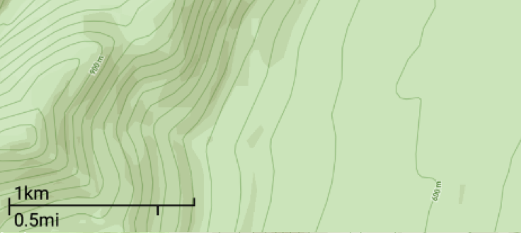

# react-native-scale-bar  [](https://badge.fury.io/js/react-native-scale-bar.svg) [](https://www.npmjs.com/package/react-native-scale-bar) [](/)


Scale bar for MapView in React Native. Works with Mapbox and Google Map.




## Installation

```
npm install --save react-native-scale-bar
```

## Usage

```
import React, { Component } from "react";
import Mapbox from "@mapbox/react-native-mapbox-gl";
import ScaleBar from "react-native-scale-bar";
import debounce from "lodash.debounce";

(...)

onUserLocationUpdate(location) {
  const latitude = location.coords.latitude;
  this.setState({latitude});
}

async handleMapChange() {
  const zoom = await this._map.getZoom();
  this.setState({zoom});
}

(...)

<Mapbox.MapView
  ref={c => (this._map = c)}
  onRegionDidChange={() => this.handleMapChange()}
  onRegionIsChanging={debounce(() => this.handleMapChange(), 200)}
  onRegionWillChange={() => this.handleMapChange()}
  onUserLocationUpdate={this.onUserLocationUpdate}
  (...)
/>

<ScaleBar zoom={this.state.zoom} latitude={this.state.latitude}/>

```

## Properties

| Prop  | Required  | Type | Default |  Description |
| :------------ |:---------------:| :---------------:| :---------------:| :-----|
| zoom | yes | `number` | - | Pass the zoom level to the component to adjust the scale bar.  |
| latitude | no | `number` | 48.8187 | Use the latitude to adjust the scale bar precision.  |
| tile_size | no | `number` | 512 | Size of the map tile. Can be either 512 (Mapbox), or 256 (Google Map)  |
| left | no | `number` | 15 | Padding with left border of the screen.  |
| bottom | no | `number` | 37 | Padding with bottom of the screen.  |

## Todo

- Option to place the scale bar anywhere on the screen
- Add imperial units
